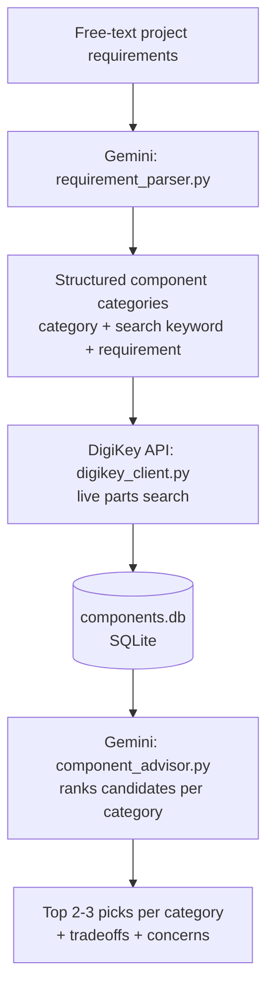

# Smart Component Selector

An AI-driven pipeline that takes a hardware project's requirements as plain English and returns real, currently-available components for each part it needs — with sourcing data pulled live from DigiKey and tradeoff analysis written by an LLM, not hardcoded rules.

Describe a project. Get back real part numbers, live pricing, stock levels, and an engineering-level explanation of why each one was picked over the alternatives.

## Why this exists

Component selection is normally: read a requirements doc, guess which search terms will find the right parts, dig through datasheets, compare specs by hand, repeat for every component in the BOM. This tool automates that loop while keeping a human in the driver's seat — it surfaces real tradeoffs (price vs. stock, package size vs. cost, spec headroom vs. requirement) instead of silently picking a "best" part.

Built as a portfolio project demonstrating Python automation, live third-party API integration, LLM-driven structured reasoning, and database design — running entirely on free-tier services.

## How it works



1. **Parse** — `requirement_parser.py` sends your free-text requirements to Gemini, which identifies every distinct electronic component category needed (not mechanical/enclosure items) and generates a DigiKey-friendly search term plus a plain-English requirement summary for each.
2. **Source** — `digikey_client.py` authenticates with DigiKey's Product Information API (OAuth2 client-credentials flow) and pulls real, currently-priced, in-stock-checked parts for every category.
3. **Store** — `components_db.py` holds everything in a SQLite database: a generic `components` table (any category, not just one part type) and a `project_categories` table that persists what the AI decided this project needs.
4. **Advise** — `component_advisor.py` sends each category's real candidates back to Gemini along with the original requirement, and asks for the top 2-3 picks with an explanation of the tradeoffs between them and anything the requirement needs that no candidate fully satisfies.
5. **Orchestrate** — `run_pipeline.py` runs all four steps end to end from a single command.

## Example run

Input (`project_spec.txt`):
> Solar-Powered Outdoor Weather Station — ultra-low-power 32-bit Wi-Fi MCU, temp/humidity sensor, barometric pressure sensor, solar-optimized Li-ion charger, 18650 battery with protection circuit, low-Iq 3.3V regulator, status LED, weatherproof connector for an external sensor. Cost-sensitive, target BOM under $15/unit.

Output (abridged):
```
=== microcontroller_wifi ===
  - ESP32-C3-WROOM-02-N4: Lowest price for a fully certified module with integrated
    antenna and excellent stock availability.
  - ESP32-C3-MINI-1-N4: Compact footprint with integrated antenna, high stock.
  Tradeoffs: The bare ESP32-C3FH4 IC saves cost and board area but requires designing
  your own antenna matching network and RF certification...

=== voltage_regulator_ldo ===
  - MCP1700T-3302E/TT: 4µA quiescent current, SOT-23-3, massive stock availability.
  Tradeoffs: All picks share identical electrical specs suitable for Li-ion operation...
```

No two runs pull the same category list — a crib monitor project and a weather station project produce entirely different, correctly-scoped components with no code changes.

## Setup

```bash
pip install -r requirements.txt
```

You'll need two free API keys as environment variables:

| Variable | Where to get it | Cost |
|---|---|---|
| `GEMINI_API_KEY` | [aistudio.google.com](https://aistudio.google.com) → Get API key | Free tier, no card required |
| `DIGIKEY_CLIENT_ID` / `DIGIKEY_CLIENT_SECRET` | [developer.digikey.com](https://developer.digikey.com) → create an app → subscribe to **Product Information V4** | Free, developer account required |

```bash
# PowerShell
$env:GEMINI_API_KEY="your_key"
$env:DIGIKEY_CLIENT_ID="your_id"
$env:DIGIKEY_CLIENT_SECRET="your_secret"

# macOS / Linux
export GEMINI_API_KEY=your_key
export DIGIKEY_CLIENT_ID=your_id
export DIGIKEY_CLIENT_SECRET=your_secret
```

## Usage

```bash
python run_pipeline.py your_project_spec.txt
```

Or run interactively and paste requirements directly into the terminal when prompted.

## Project structure

```
run_pipeline.py          # orchestrates the full pipeline
requirement_parser.py    # AI: free text -> component categories + search terms
digikey_client.py        # DigiKey OAuth2 + live keyword search
components_db.py         # SQLite schema and data access
populate_components.py   # pulls real parts into the database per category
component_advisor.py     # AI: ranks candidates, explains tradeoffs
main.py                  # earlier standalone MCU-only demo (kept for reference)
ai_selector.py           # earlier MCU-only AI selector (superseded by the category pipeline)
```

## Tech stack

- **Python** — sqlite3, requests
- **Google Gemini API** (`gemini-3.6-flash`) — free-tier structured JSON output for requirement parsing and tradeoff reasoning
- **DigiKey Product Information API v4** — OAuth2 client-credentials flow, live component data
- **SQLite** — local persistence, no server required

## Known limitations

- DigiKey keyword search occasionally surfaces pre-assembled dev boards or breakout boards alongside bare ICs/components — worth a human sanity check before finalizing a BOM.
- No cross-category constraint checking yet (e.g. confirming the chosen regulator's output current actually covers every downstream component's draw).
- Free-tier rate limits apply on both APIs; large requirement lists (15+ categories) may need the built-in retry/backoff to ride out occasional `503` errors from Gemini.

## Possible next steps

- Cross-category power budget validation (sum current draw, check against battery/regulator capacity)
- Export the final report as a structured BOM (CSV/XLSX)
- Support Mouser/LCSC/Octopart as additional or fallback data sources
