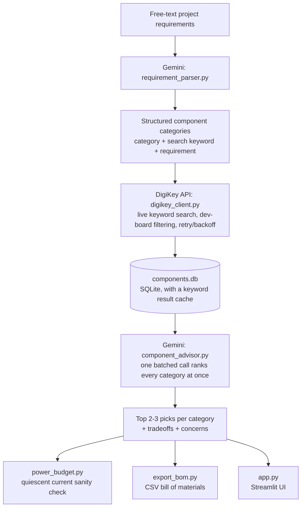

# Smart Component Selector

An AI-driven pipeline that takes a hardware project's requirements as plain English and returns real, currently available components for each part it needs, with sourcing data pulled live from DigiKey and tradeoff analysis written by an LLM, not hardcoded rules.

Describe a project. Get back real part numbers, live pricing, stock levels, an engineering-level explanation of why each one was picked over the alternatives, a best-effort power budget check, and a downloadable BOM.

**Live demo:** [smart-component-selector.streamlit.app](https://smart-component-selector.streamlit.app)

## Why this exists

Component selection is normally: read a requirements doc, guess which search terms will find the right parts, dig through datasheets, compare specs by hand, repeat for every component in the BOM. This tool automates that loop while keeping a human in the driver's seat. It surfaces real tradeoffs (price vs stock, package size vs cost, spec headroom vs requirement) instead of silently picking a "best" part.

Built as a portfolio project demonstrating Python automation, live third-party API integration, LLM-driven structured reasoning, database design, and a deployed UI, running entirely on free-tier services.

## How it works



1. **Parse** - `requirement_parser.py` sends your free-text requirements to Gemini, which identifies every distinct electronic component category needed (not mechanical/enclosure items) and generates a DigiKey-friendly search term plus a plain-English requirement summary for each. Category names are nudged toward a consistent vocabulary so the same component type does not fragment into near-duplicates across runs.
2. **Source** - `digikey_client.py` authenticates with DigiKey's Product Information API (OAuth2 client-credentials flow) and pulls real, currently priced, in-stock-checked parts for every category. If a keyword returns nothing, `populate_components.py` automatically retries with a broader term. Results are cached locally for 24 hours, and requests back off automatically on rate limiting.
3. **Filter** - Breakout boards, dev boards, and eval kits are filtered out of the results by default, so the BOM stays focused on real, production-ready components rather than hobbyist modules.
4. **Store** - `components_db.py` holds everything in a SQLite database: a generic `components` table (any category, not just one part type) and a `project_categories` table that persists what the AI decided this project needs.
5. **Advise** - `component_advisor.py` sends every category's real candidates back to Gemini in a single batched request and asks for the top 2-3 picks per category, with tradeoffs and any concerns. Batching keeps this to one AI call per run instead of one per category, which matters a lot on Gemini's free-tier daily quota.
6. **Check** - `power_budget.py` does a best-effort sanity check: it sums whatever quiescent/standby current figures DigiKey's parametric data actually provides and compares that against the voltage regulator's rated output current. It is upfront about what it cannot see (active/peak loads).
7. **Export** - `export_bom.py` writes the final picks, prices, stock, and reasoning to a CSV bill of materials.
8. **Orchestrate** - `run_pipeline.py` runs all of the above end to end from a single command, or `app.py` runs it from a Streamlit UI.

## Example run

Input:
> Solar-Powered Outdoor Weather Station: ultra-low-power 32-bit Wi-Fi MCU, temp/humidity sensor, barometric pressure sensor, solar-optimized Li-ion charger, 18650 battery with protection circuit, low-Iq 3.3V regulator, status LED, weatherproof connector for an external sensor. Cost-sensitive, target BOM under $15/unit.

Output (abridged):
```
=== microcontroller_wifi ===
  - ESP32-C3-WROOM-02-N4: Lowest price for a fully certified module with integrated
    antenna and excellent stock availability.
  - ESP32-C3-MINI-1-N4: Compact footprint with integrated antenna, high stock.
  Tradeoffs: The bare ESP32-C3FH4 IC saves cost and board area but requires designing
  your own antenna matching network and RF certification...

=== voltage_regulator_3v3 ===
  - TPS62840YBGR: 60nA quiescent current, up to 750mA output, ideal for maximizing
    battery life on a Li-ion cell.
  Tradeoffs: The LDO alternative is cheaper but less efficient stepping down from a
  fully charged cell...

--- Power Budget Check (best-effort, quiescent draw only) ---
Regulator (voltage_regulator_3v3) rated max output current: 750.0 mA
...
```

No two runs pull the same category list. A crib monitor project and a weather station project produce entirely different, correctly scoped components with no code changes.

## Setup

```bash
pip install -r requirements.txt
```

You will need two free API keys:

| Variable | Where to get it | Cost |
|---|---|---|
| `GEMINI_API_KEY` | [aistudio.google.com](https://aistudio.google.com), Get API key | Free tier, no card required, 20 requests/day |
| `DIGIKEY_CLIENT_ID` / `DIGIKEY_CLIENT_SECRET` | [developer.digikey.com](https://developer.digikey.com), create an app, subscribe to **Product Information V4** | Free, developer account required |

**Running locally**, set them as environment variables:

```bash
# PowerShell
$env:GEMINI_API_KEY="your_key"
$env:DIGIKEY_CLIENT_ID="your_id"
$env:DIGIKEY_CLIENT_SECRET="your_secret"

# macOS / Linux
export GEMINI_API_KEY=your_key
export DIGIKEY_CLIENT_ID=your_id
export DIGIKEY_CLIENT_SECRET=your_secret
```

**Deploying on Streamlit Community Cloud**, set the same three values under your app's Settings, Secrets, instead. `app.py` reads from either source automatically.

## Usage

**Command line:**
```bash
python run_pipeline.py your_project_spec.txt
```
Or run it with no arguments and paste requirements directly into the terminal when prompted.

**Streamlit UI:**
```bash
streamlit run app.py
```
Paste your requirements, click Run pipeline, and browse the ranked results, power budget check, and BOM download in the browser.

## Project structure

```
app.py                    # Streamlit UI
run_pipeline.py           # orchestrates the full CLI pipeline
requirement_parser.py     # AI: free text -> component categories + search terms
digikey_client.py         # DigiKey OAuth2, live keyword search, dev-board filtering, retry/backoff
populate_components.py    # pulls real parts into the database, with keyword fallback and caching
components_db.py          # SQLite schema, data access, category name normalization
component_advisor.py      # AI: ranks candidates in one batched call, explains tradeoffs
power_budget.py           # best-effort quiescent current budget check
export_bom.py             # exports the final report as a CSV bill of materials
main.py                   # earlier standalone MCU-only demo (kept for reference)
ai_selector.py            # earlier MCU-only AI selector (superseded by the category pipeline)
```

## Tech stack

- **Python** - sqlite3, requests, csv
- **Google Gemini API** (`gemini-3.6-flash`) - free-tier structured JSON output for requirement parsing and tradeoff reasoning, batched to stay within the daily request quota
- **DigiKey Product Information API v4** - OAuth2 client-credentials flow, live component data
- **SQLite** - local persistence and a keyword result cache, no server required
- **Streamlit** - deployed UI, reads secrets from either environment variables or Streamlit Cloud's secrets manager

## Known limitations

- DigiKey's keyword-search endpoint does not reliably expose quiescent/standby current in its parametric data for most part types (confirmed by testing: active current ratings like drain current, RX/TX current, and test current show up, but idle draw generally does not). The power budget check is transparent about this and lists what current-related fields it did find so you can check datasheets manually.
- Dev-board filtering is keyword-based, not a real category classifier. It catches the common cases (breakout, eval kit, Feather, Qwiic, and so on) but is not exhaustive.
- No cross-category electrical constraint checking beyond the quiescent current sum (for example, confirming the regulator can also cover peak/active loads across every downstream component).
- Gemini's free tier caps out at 20 requests/day. Batching keeps each run to 1-2 calls, but repeated testing in a single day can still exhaust it, in which case the pipeline fails cleanly with a clear message instead of crashing.
- DigiKey's catalog is sometimes thin on certain raw component types (bare Hall-effect flow sensors, for example), where fallback keywords surface complete assembled modules instead. This shows up as a `concerns` note in the output rather than being silently hidden.

## Possible next steps

- Active/peak load estimation to complement the quiescent-only power budget check
- Support Mouser/LCSC/Octopart as additional or fallback data sources
- Editable pre-run filters in the UI (price cap, exclude dev boards toggle, minimum stock)
- A proper category taxonomy instead of prompt-level naming hints, to fully eliminate near-duplicate categories across projects